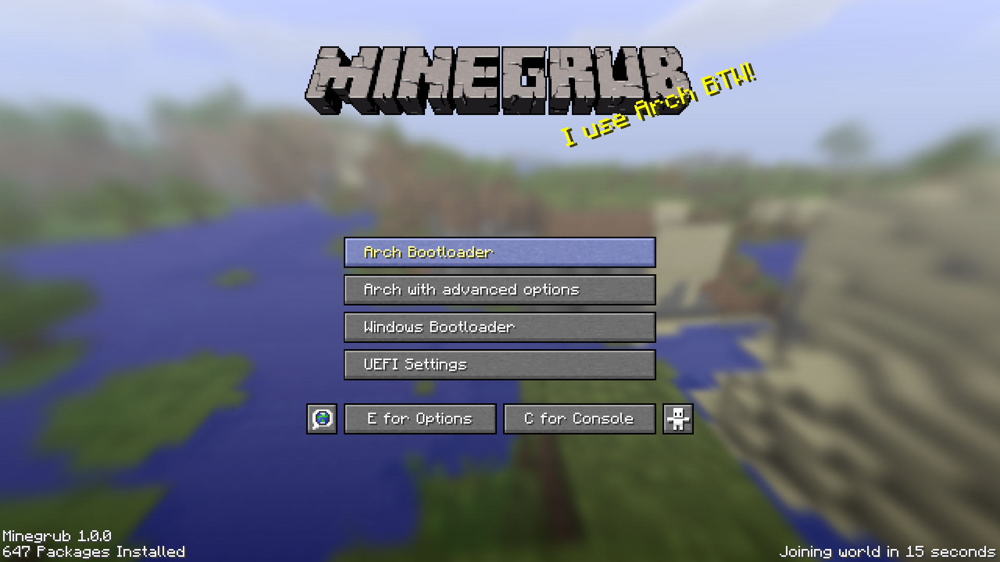

# ⛏️ Minegrub — Minecraft GRUB Bootloader Theme

<p align="center">
  
</p>

<p align="center">
  
  
  
  
</p>

---

### 🎨 Included HD Minecraft Wallpapers (1080p)
The theme comes bundled with **13 high-definition Minecraft update wallpapers** that can be shuffled automatically on every boot or selected manually:

| Classic & World | Village, Bees & Nether | Caves & Modern Updates |
|:---:|:---:|:---:|
| **1.8 Classic Minecraft** | **1.14 Village & Pillage** | **1.17 Caves & Cliffs** |
| **Alpha & Alpha w/ Herobrine** | **1.15 Buzzy Bees** | **1.18 Caves & Cliffs Part II** |
| **The End & pack.png** | **1.16 Nether Update** | **1.19 The Wild & 1.20 Trails** |

---

## ✨ Features

- 🎮 **Authentic Minecraft Experience**:
  - Custom pixel-art stone buttons with authentic hover/selection highlights.
  - Authentic `Minecraft30` and `Monocraft22` fonts.
  - Dirt-tile background for GRUB console (`c` key) and option menus.
  - Animated countdown timer: *"Joining world in %d seconds"*.
  - Yellow splash text slogans next to the 3D Minecraft logo.
- 🪟 **First-Class Windows (Grub2Win) Support**:
  - **1-Click automated installer** (`install_grub2win.bat`) that copies themes, fonts, aligns boot buttons, and patches templates.
  - Native **1920x1080 Full HD** widescreen configuration with zero stretching or distortion.
  - Clean button rendering without overlapping OS class icons.
  - Template persistence: your settings won't get overwritten when using the Grub2Win GUI.
- 🔄 **Automatic Background Shuffle**:
  - **Windows**: Built-in scheduled task randomizes the wallpaper each time you log on.
  - **Linux**: Systemd service rotates splash slogans and wallpapers after each boot.
- 🐧 **Universal Linux Compatibility**:
  - Works out of the box with Arch, Garuda, Ubuntu, Debian, Fedora, openSUSE, Manjaro, EndeavourOS, and more.

---

## 🚀 Installation Guide

### 🪟 Windows (Grub2Win)

#### Option A: 1-Click Automated Installer (Recommended)

1. Make sure **[Grub2Win](https://sourceforge.net/projects/grub2win/)** is installed on your computer.
2. Clone or download this repository:
   ```cmd
   git clone https://github.com/priyanshuthakare/Grub-Boot-Loader-Theme-Windows.git
   ```
3. Navigate to the folder, right-click **`install_grub2win.bat`**, and select **Run as Administrator**.
4. The installer will automatically:
   - Copy the Minegrub theme and Minecraft fonts (`Minecraft30.pf2`, `Minecraft24.pf2`, `Monocraft22.pf2`) to `C:\grub2`.
   - Copy all 13 background options into the theme directory.
   - Detect your boot options and align the bottom bar perfectly.
   - Lock the resolution to native **1920x1080** Full HD.
   - Patch Grub2Win templates so the theme persists even after saving in the Grub2Win application.
   - Register the `MinegrubBackgroundShuffle` task to rotate wallpapers on logon.
5. **Reboot your computer** to see the theme!

> [!NOTE]
> **Why doesn't the Grub2Win desktop app show the Minecraft preview?**  
> The Grub2Win Windows application only renders an internal mock preview of its built-in generic presets (like "Basic"). It cannot render custom external GRUB themes inside Windows. The real Minegrub theme renders during actual system boot.

---

#### Option B: Manual Installation (Windows)

1. Copy the `minegrub` directory to `C:\grub2\themes\minegrub`.
2. Copy all `.png` files from `background_options\` to `C:\grub2\themes\minegrub\backgrounds\`.
3. Copy all `.pf2` fonts from `minegrub\` to `C:\grub2\fonts\`.
4. Open `C:\grub2\winsource\template.theme.cfg` and replace its content with:
   ```grub
   set theme=$prefix/themes/minegrub/theme.txt
   unset icondir
   export theme
   ```
5. Open `C:\grub2\winsource\template.gfxmenu.cfg` and ensure resolution is set to Full HD:
   ```grub
   set gfxmode=1920x1080,auto
   ```
6. Open `C:\grub2\grub.cfg`, locate the theme section, and update:
   ```grub
   set gfxmode=1920x1080,auto
   set theme=$prefix/themes/minegrub/theme.txt
   unset icondir
   export theme
   ```

---

### 🐧 Linux (Garuda / Arch / Ubuntu / Debian / Fedora)

#### Option A: Automated Script

1. Open your terminal and clone the repository:
   ```bash
   git clone https://github.com/priyanshuthakare/Grub-Boot-Loader-Theme-Windows.git
   cd Grub-Boot-Loader-Theme-Windows
   ```
2. Run the Linux installation script as root:
   ```bash
   sudo ./install_theme.sh
   ```
3. Follow the on-screen prompts:
   - Choose a background or keep random.
   - Install the systemd auto-update service (updates splash texts & wallpaper on boot).
   - Patch the GRUB console background.
4. Regenerate your GRUB configuration:
   ```bash
   # Arch Linux / Garuda / Manjaro:
   sudo grub-mkconfig -o /boot/grub/grub.cfg

   # Ubuntu / Debian / Linux Mint:
   sudo update-grub

   # Fedora / RHEL:
   sudo grub2-mkconfig -o /boot/grub2/grub.cfg
   ```

---

#### Option B: Manual Installation (Linux)

1. Copy the theme directory:
   ```bash
   sudo cp -ruv ./minegrub /boot/grub/themes/
   ```
2. Open `/etc/default/grub` in an editor (`sudo nano /etc/default/grub`) and add/modify:
   ```bash
   GRUB_THEME="/boot/grub/themes/minegrub/theme.txt"
   GRUB_GFXMODE="1920x1080,auto"
   ```
3. Regenerate GRUB:
   ```bash
   sudo grub-mkconfig -o /boot/grub/grub.cfg
   ```

---

## 🎲 Managing Wallpapers

### Choose a Specific Wallpaper
- **Windows**: Double-click **`choose_background.bat`** and enter the number corresponding to your preferred background.
- **Linux**: Run `./choose_background.sh`.

### Shuffle Wallpapers
- **Windows**: Run `powershell -ExecutionPolicy Bypass -File .\shuffle-background.ps1` to randomize the background immediately.
- **Auto-Shuffle**: The Windows scheduled task (`MinegrubBackgroundShuffle`) handles this on every logon automatically.

---

## ⚙️ Customization

### Adjusting Boot Options Alignment
If your boot options overlap with the static bottom bar ("Options" / "Console"), adjust the `top` position in `minegrub/theme.txt`:

$$\text{top} = 40\% + (72 \times N + 26)$$

*(where $N$ is your total number of boot menu entries)*

| Boot Entries | Value in `theme.txt` |
|:---:|:---|
| **2 options** | `top = 40%+170` |
| **3 options** | `top = 40%+242` |
| **4 options** *(default)* | `top = 40%+314` |
| **5 options** | `top = 40%+386` |
| **6 options** | `top = 40%+458` |
| **7 options** | `top = 40%+530` |

*Note: The Windows installer `install_grub2win.bat` calculates and sets this automatically based on your `grub.cfg`.*

### Custom Splash Slogans
Add your own splash messages to `minegrub/assets/splashes.txt`. Each line in the file is a candidate splash that can appear beside the Minecraft logo!

---

## 🗑️ Uninstallation

### Windows
Run `powershell -ExecutionPolicy Bypass -File .\uninstall_grub2win.ps1` as Administrator, or:
```powershell
Unregister-ScheduledTask -TaskName "MinegrubBackgroundShuffle" -Confirm:$false
Remove-Item -Path "C:\grub2\themes\minegrub" -Recurse -Force
```
Then open Grub2Win and click **OK** to regenerate standard templates.

### Linux
1. Remove `GRUB_THEME` from `/etc/default/grub`.
2. Delete `/boot/grub/themes/minegrub`.
3. Run `sudo grub-mkconfig -o /boot/grub/grub.cfg`.

---

## 📜 Credits & Attributions

- Original Minegrub theme created by [Lxtharia](https://github.com/Lxtharia/minegrub-theme).
- Windows Grub2Win port, automation scripts, widescreen enhancements, and fixes by [priyanshuthakare](https://github.com/priyanshuthakare/Grub-Boot-Loader-Theme-Windows).
- Fonts: [Minecraft font](https://www.fontspace.com/minecraft-font-f28180) and [Monocraft font](https://github.com/IdreesInc/Monocraft).
- Wallpapers provided by Mojang Studios and [Vanilla Tweaks](https://vanillatweaks.net).
- Distributed under the [MIT License](LICENSE).
